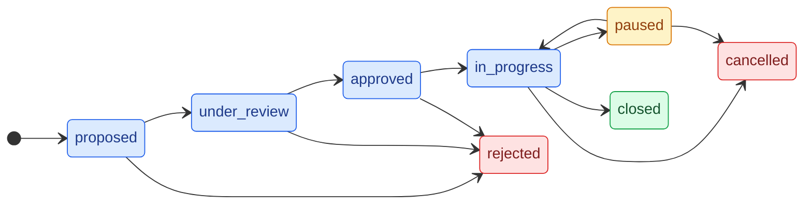

# Arquitectura del Backend

API REST construida con **NestJS 11** sobre **Node.js 26**, usando **Prisma 7**
(adaptador `pg`) y **PostgreSQL 15**. Los archivos se guardan en **MinIO/S3**.
La especificación OpenAPI se publica con Swagger.

Ver también: [Esquema de base de datos](./database_arch.md),
[Arquitectura del frontend](./frontend_arch.md) y el
[plan de SSO](./sso-plan.md).

## Resumen

| Aspecto | Elección |
| --- | --- |
| Framework | NestJS 11 (módulos, controllers, services, guards) |
| Lenguaje | TypeScript sobre Node.js 26 |
| Base de datos | PostgreSQL 15 vía Prisma 7 (adaptador `pg`) |
| Almacenamiento | MinIO localmente, compatible con S3 en producción |
| Autenticación | Tokens HMAC-SHA256 propios + hash de contraseñas con scrypt |
| Documentación | Swagger / OpenAPI en `/api` |
| Pruebas | Tests unitarios con Jest y e2e con Supertest |

## Arranque

`src/main.ts` es el punto de entrada:

- Crea la app a partir de `AppModule`.
- Registra un `ValidationPipe` global (`whitelist` + `transform`), de modo que
  los campos desconocidos se eliminan y los DTOs se convierten a sus tipos.
- Publica Swagger en `/api`.
- Escucha en `PORT` (por defecto `3001`).

`AppModule` importa los módulos de dominio, carga las variables de entorno con
`ConfigModule` y aplica `LoggerMiddleware` a todos los controladores.

### Ciclo de vida de una petición

1. **LoggerMiddleware** asigna un `request-id` (reutiliza `x-request-id` o
   genera uno), lo devuelve en la respuesta y, al terminar, registra una línea
   JSON con método, ruta, status, duración y usuario.
2. Los **guards** (`AuthGuard`, `AdminGuard`) autentican y autorizan.
3. Los **pipes** validan y transforman el body/params en DTOs.
4. El **controller** despacha al método del service correspondiente.
5. El **service** aplica las reglas de negocio, llama a
   `AuthorizationService`, `PrismaService` y/o `StorageService`, y mapea el
   resultado.
6. La respuesta se serializa como JSON (o se envía como stream en descargas).

### Logging de peticiones

`LoggerMiddleware` emite una línea JSON por petición cuando termina la
respuesta, con `timestamp`, `level`, `requestId`, `method`, `path`, `status`,
`durationMs` y `userId` (`null` si es anónima). El nivel se deriva del status
(`5xx` → `error`, `4xx` → `warn`, resto → `log`) y solo se emite si alcanza
`LOG_LEVEL`. Las líneas `warn`/`error` van a stderr y el resto a stdout.

## Capas

| Capa | Responsabilidad |
| --- | --- |
| **Controller** | Define rutas, valida DTOs y recibe al usuario autenticado. Delgado por diseño. |
| **Guard** | `AuthGuard` valida el token Bearer; `AdminGuard` exige el rol `admin`. |
| **Service** | Lógica de negocio, reglas de estado y mapeo de respuestas. Un service por dominio. |
| **AuthorizationService** | Centraliza las reglas de permisos (rol global + rol en el proyecto). |
| **PrismaService** | Acceso a datos (cliente Prisma con adaptador `pg`). |
| **StorageService** | Abstracción de archivos; la implementación concreta es `S3StorageService`. |

Los services devuelven **tipos de respuesta propios** (`ProjectDetailResponse`,
etc.) en lugar de modelos crudos de Prisma, para no filtrar detalles de la base
de datos y mantener estable el contrato de la API aunque cambie el esquema.

## Módulos

| Módulo | Descripción |
| --- | --- |
| **Auth** | Registro público, login, gestión de usuarios y asignación de roles. Crea el primer admin. |
| **Projects** | CRUD de proyectos, asignación de actores y transición de estados. |
| **Observations** | Observaciones de texto libre asociadas a un proyecto. |
| **Milestones** | Entregables programados por proyecto. |
| **Attachments** | Subida, listado, descarga y borrado de archivos. |
| **Storage** | Expone `StorageService` para el módulo de anexos (S3/MinIO). |

## Autenticación y autorización

El login (`POST /auth/login`) verifica la contraseña con **scrypt** (sal
aleatoria, clave de 64 bytes) y emite un token **HMAC-SHA256** de 24 horas (sin
librerías externas). `AuthGuard` valida el header
`Authorization: Bearer <token>`, comprueba la expiración y carga el usuario en
`request.user`.

Roles globales (`UserRole`): `admin`, `evaluator`, `coordinator`, `advisor`,
`student`, `proposer`. Roles dentro de un proyecto (`ActorRole`): `advisor`,
`coordinator`, `student`, `evaluator`.

`proposer` identifica a los proponentes externos que se registran solos desde
`/register`. No es un `ActorRole`, así que no se les asigna como actores;
proponen proyectos y, como proponentes del proyecto, pueden editarlo mientras
siga en `proposed` o `under_review`.

`AuthorizationService` responde preguntas como "¿puede este usuario crear un
proyecto?", "¿puede gestionar este proyecto?" o "¿puede asignar actores?",
combinando el rol global con la asignación en el proyecto. El `admin` siempre
pasa.

### Matriz de permisos

Leyenda: **público** = no requiere token, **miembro** = asignado al proyecto,
**rol** = requiere el rol global más la asignación correspondiente en el
proyecto. El `admin` siempre pasa.

| Acción | Público | admin | coordinator | evaluator | advisor | student |
| --- | :---: | :---: | :---: | :---: | :---: | :---: |
| Listar / ver proyectos | sí | sí | sí | sí | sí | sí |
| Crear proyecto | no | rol | rol | rol | rol | rol |
| Editar datos del proyecto | no | sí | miembro | sí | miembro | no† |
| Gestionar proyecto / asignar actores | no | sí | miembro | no | no | no |
| Gestionar hitos | no | sí | miembro | miembro | miembro | no |
| Avanzar fase (semestre) | no | sí | miembro | no | no | no |
| Cambiar estado | no | sí | miembro | miembro* | no | no |
| Ver observaciones / hitos / anexos | no | sí | miembro | miembro | miembro | miembro |
| Comentar un proyecto | no | sí | miembro | miembro | miembro | miembro |

- `Crear proyecto` solo requiere que el usuario tenga al menos un rol global.
- `Editar datos del proyecto`: lo permiten `admin` y cualquier `evaluator`
  global (sin asignarse); un `coordinator` o `advisor` solo si está asignado al
  proyecto con su rol correspondiente. Un proyecto `closed` o `rejected` es de
  solo lectura (responde `409`). Cada campo modificado se registra en
  `ProjectChangeHistory`.
- \* Los evaluadores gestionan la fase de propuesta (`proposed`/`under_review` y
  `approved → rejected`); el resto de transiciones son acciones de coordinador
  (`approved → in_progress`, `in_progress → {paused, closed, cancelled}`,
  `paused → {in_progress, cancelled}`).
- † El `student` no edita los datos por su rol, pero el **proponente** (de
  cualquier rol global, incluido `student`) puede editar mientras el proyecto
  esté en `proposed` o `under_review`.

Al arrancar, `AuthService` crea un admin inicial si la base de datos está vacía
y existen `INITIAL_ADMIN_EMAIL`, `INITIAL_ADMIN_PASSWORD` y
`INITIAL_ADMIN_NAME`.

## Ciclo de vida del proyecto

El camino feliz es:

```
proposed → under_review → approved → in_progress → closed
```

`rejected` es terminal y se alcanza desde la fase de propuesta
(`proposed`/`under_review`/`approved`). `cancelled` también es terminal y
representa un proyecto que se canceló **después de haber empezado** (desde
`in_progress` o `paused`); `paused` suspende la ejecución y permite reanudarla o
cancelarla. Las transiciones se validan en `ProjectsService`; cada cambio se
registra en `ProjectStatusHistory` dentro de una transacción, exige un motivo
(salvo para `admin`) y respeta los permisos del rol que realiza la transición.

| Desde | Siguientes estados permitidos |
| --- | --- |
| `proposed` | `under_review`, `rejected` |
| `under_review` | `approved`, `rejected` |
| `approved` | `in_progress`, `rejected` |
| `in_progress` | `paused`, `closed`, `cancelled` |
| `paused` | `in_progress`, `cancelled` |
| `closed` / `cancelled` / `rejected` | — (terminal) |

Los evaluadores gestionan las transiciones de la fase de propuesta
(`proposed`/`under_review`, y `approved → rejected`); los coordinadores
asignados gestionan el resto (`approved → in_progress`, `in_progress → {paused,
closed, cancelled}`, `paused → {in_progress, cancelled}`).

### Fases (semestres) e hitos mínimos

La **fase** (`phase`, `semester_1` → `semester_2`) es independiente del estado:
un proyecto puede estar `in_progress` y avanzar de semestre sin cambiar de
estado. `POST /projects/:id/phase/advance` avanza la fase solo cuando el
proyecto está `in_progress`, todos los **hitos mínimos** de la fase actual (más
los globales, sin fase) están completos y el **visto bueno de fase** está
completo: el proponente del proyecto y cada evaluador asignado aprobaron la fase
destino con `POST /projects/:id/phase/approvals`. Si falta algo, responde `409`
con los pendientes. El bloqueo es duro, sin excepción para `admin`, y el avance
se registra en `ProjectChangeHistory` (`field = "phase"`). Cada aprobador puede
retirar su visto bueno con `DELETE /projects/:id/phase/approvals` mientras no se
haya avanzado.

Los **hitos mínimos** son los marcados con `isMinimum`. Son obligatorios para
avanzar de fase y para cerrar el proyecto: la transición `in_progress → closed`
también responde `409` mientras quede algún hito mínimo sin completar. La regla
es un bloqueo duro, sin excepción para `admin`. Rechazar un proyecto nunca se
bloquea.

### Hitos y entregas

Un hito se puede vincular con una o varias **entregas** (`ProjectReport`) y una
entrega con varios hitos (tabla intermedia `MilestoneReportLink`). Al crear o
editar un hito se envía `reportIds` con las entregas a vincular (solo del mismo
proyecto). **Un hito no se puede completar** mientras alguna entrega vinculada
no esté `accepted`; la API responde `409` con las entregas pendientes. Volver a
marcarlo como pendiente siempre está permitido.

Eliminar un hito o una entrega solo borra sus enlaces: la otra parte no se toca.
La interfaz avisa antes de eliminarlos indicando qué se desvinculará.

Todo proyecto nuevo nace con el hito mínimo **«Documento final»** en
`semester_2`, con vencimiento a un año de la fecha de inicio (o de la fecha de
creación si no se indicó inicio), **más una entrega «Documento final»** de tipo
Archivo (PDF/Word, máximo 1 archivo) vinculada a él. Es el artículo/documento
final que cada grupo debe adjuntar y que debe ser aceptado para cerrar el
proyecto; el hito y la entrega se pueden editar o eliminar como cualquier otro.



## Modelo de datos

El esquema Prisma completo está documentado en
[database_arch.md](./database_arch.md). En resumen:

- **Usuario**: `User`, `UserRoleAssignment`.
- **Proyecto**: `Project`, `ProjectSchool`, `ProjectNaturalProposer`,
  `ProjectDeliverable`.
- **Equipo y seguimiento**: `ProjectActorAssignment`, `ProjectObservation`,
  `ProjectStatusHistory`, `ProjectChangeHistory`, `ProjectMilestones`,
  `MilestoneReportLink`.
- **Archivos**: `ProjectAttachment` (solo metadatos; el binario vive en
  S3/MinIO).

## Anexos

`AttachmentsController` recibe `multipart/form-data` mediante `FileInterceptor`
(almacenamiento en memoria). Límite de **10 MB** y lista blanca de MIME (PDF,
Word, Excel, PNG, JPEG). El service sube el archivo a S3 y, si falla el
registro en la base de datos, lo elimina para no dejar huérfanos. Las descargas
se envían como stream con el nombre original en el header `Content-Disposition`.

Los archivos vinculados a una entrega (`reportId` no nulo) se excluyen del
listado de Anexos y se sirven desde la pestaña Entregas.

## Entregas

Una entrega (`ProjectReport`) tiene un **tipo** fijo (`type`: `text`, `link` o
`file`) definido por el asesor/evaluador/coordinador al crearla; solo se puede
cambiar mientras esté `pending` y no tenga contenido. Para el tipo Archivo
(`file`) también se eligen los MIME permitidos (`allowedMimeTypes`) y el máximo
de archivos (`maxFiles`), obligatorios al crear. El estudiante agrega
**contenido** (`ProjectReportContent`) que debe coincidir con ese `type` (el
backend rechaza con `400` cualquier `kind` distinto). Los textos y enlaces se
guardan en la propia fila (`textContent`, `url`, `label`); los archivos
(documentos, imágenes y videos) reutilizan `ProjectAttachment` (`attachmentId`) y
por tanto el mismo almacenamiento S3. El contenido solo se puede modificar
mientras la entrega esté `pending` o `rejected`; al enviarla se valida que tenga
al menos una pieza.

Cada entrega expone en la API los hitos a los que está vinculada
(`milestones`), y cada hito expone sus entregas vinculadas (`reports`) con su
estado. Ver [Hitos y entregas](#hitos-y-entregas).

`POST .../contents/files/presign` acepta documentos (PDF, Word, Excel), imágenes
(PNG, JPEG, WebP, GIF) y videos (MP4, WebM, OGG) hasta
`MAX_REPORT_FILE_SIZE_BYTES` (100 MB por defecto); valida que el MIME esté entre
los `allowedMimeTypes` de la entrega y que no se haya superado `maxFiles` (si no,
`409`), y devuelve una URL `PUT` prefirmada con `S3_PUBLIC_ENDPOINT`. El navegador
sube el binario directamente a MinIO/S3 y luego `POST .../contents/files/confirm`
verifica el objeto con `HeadObject` (tamaño real, existencia) y crea
`ProjectAttachment` + `ProjectReportContent`. Si el objeto excede el límite, se
borra y se responde `400`. `GET .../contents/:cid/stream` sirve el archivo inline
y reenvía la cabecera `Range` a S3 para responder `206 Partial Content`, lo que
permite reproducir y buscar dentro de un video. Los objetos subidos pero nunca
confirmados se limpian con `npm run storage:gc`.

## Manejo de errores

Se usan las excepciones HTTP integradas de Nest, por lo que las respuestas
siguen una forma consistente (`statusCode`, `message`, `error`):

| Estado | Cuándo |
| --- | --- |
| `400` | DTO inválido, transición de estado inválida o motivo faltante. |
| `401` | Token ausente, malformado o expirado. |
| `403` | Autenticado pero sin rol/asignación en el proyecto. |
| `404` | Proyecto, usuario, hito o anexo no encontrado. |
| `409` | Valor único duplicado (por ejemplo email o asignación de actor). |
| `500` | Configuración requerida faltante (S3, secreto de auth). |
| `503` | La base de datos no está disponible (conexión rechazada o agotada). |

Los errores de conexión a PostgreSQL (`P1001`, `P1002`, `P1008`, `P1017` y
códigos del driver como `ECONNREFUSED`) se traducen a `503 Service Unavailable`
con la misma forma JSON mediante `DatabaseExceptionFilter`. El resto de errores
mantiene el manejo por defecto de Nest. El servicio arranca aunque la base de
datos esté caída: omite la creación del admin inicial y responde `503` en las
rutas que la necesitan.

## Configuración

| Variable | Propósito |
| --- | --- |
| `DATABASE_URL` | Cadena de conexión a PostgreSQL. |
| `AUTH_SECRET` | Clave de firma HMAC (mínimo 32 caracteres). |
| `INITIAL_ADMIN_*` | Email, contraseña y nombre del admin inicial. |
| `MAX_FILE_SIZE_BYTES` | Límite de tamaño de anexos (por defecto 10 MB). |
| `MAX_REPORT_FILE_SIZE_BYTES` | Límite de tamaño de archivos de una entrega (100 MB por defecto). |
| `S3_ENDPOINT`, `S3_BUCKET`, `S3_ACCESS_KEY`, `S3_SECRET_KEY` | Almacenamiento de archivos. |
| `S3_REGION`, `S3_FORCE_PATH_STYLE` | Ajustes del cliente S3 (`true` para MinIO). |
| `S3_PUBLIC_ENDPOINT` | Host de S3/MinIO que alcanza el navegador; usado para firmar las subidas directas. |
| `S3_UPLOAD_URL_TTL_SECONDS` | Vigencia de la URL prefirmada de subida (3600 s por defecto). |
| `LOG_LEVEL` | Nivel mínimo del log de peticiones (`error`, `warn`, `log`/`info` o `debug`; `log` por defecto). |

## Semillas y migraciones

En `prisma/`:

- `schema.prisma` y `migrations/` — esquema y migraciones.
- `seed.ts` + `seed/` — datos de ejemplo por dominio.
- `fixtures/` — datos JSON y archivos de anexos.

Comandos: `npx prisma migrate dev`, `npm run seed` (y variantes como
`seed:users`, `seed:projects`, etc.).

## Mantenimiento

- `npm run storage:gc` — borra de MinIO/S3 los objetos sin `ProjectAttachment`
  (subidas que nunca se confirmaron). Flags: `--dry-run` y
  `--max-age-hours=N` (24 h por defecto). Entrada en
  `src/storage/gc-cli.ts`; lógica en `src/storage/storage-gc.service.ts`.

## Pruebas

- Tests unitarios: `npm test` (Jest, archivos `*.spec.ts` junto al código).
- Watch / cobertura: `npm run test:watch`, `npm run test:cov`.
- End-to-end: `npm run test:e2e` (Supertest).

## Endpoints principales

| Método | Ruta | Descripción |
| --- | --- | --- |
| `GET` | `/health` | Sonda pública: `200` si la base de datos responde, `503` si no. |
| `POST` | `/auth/register` | Registro público de un proponente; crea la cuenta con rol `proposer` y devuelve usuario + token (público). |
| `POST` | `/auth/login` | Iniciar sesión y recibir un token de acceso (público). |
| `GET/POST` | `/auth/users` | Listar / crear usuarios (admin). |
| `PATCH` | `/auth/users/:id/roles` | Reemplazar los roles de un usuario (admin). |
| `GET` | `/projects` | Listar los proyectos visibles para el solicitante (público: solo finalizados y no privados). |
| `GET` | `/projects/mine` | Proyectos propuestos y asignados al usuario. |
| `GET` | `/projects/:id` | Detalle (404 si el proyecto es privado y el solicitante no es miembro). |
| `POST` | `/projects` | Crear un proyecto; `isPrivate` lo define el proponente. |
| `PUT` | `/projects/:id` | Editar los datos (admin, evaluador, coordinador/asesor asignado o proponente en revisión; `409` si está finalizado/rechazado). Registra historial por campo. |
| `DELETE` | `/projects/:id` | Borrar (admin o coordinador asignado). |
| `PATCH` | `/projects/:id/status` | Cambiar estado (registra historial). |
| `POST` | `/projects/:id/phase/advance` | Avanzar de fase (semestre) si los hitos mínimos están completos y el proponente y los evaluadores dieron su visto bueno (`409` si no). |
| `POST` | `/projects/:id/phase/approvals` | Dar el visto bueno de fase (proponente o evaluador asignado). |
| `DELETE` | `/projects/:id/phase/approvals` | Retirar el visto bueno de fase propio. |
| `POST` | `/projects/:id/actors` | Asignar un usuario a un proyecto. |
| `GET/POST` | `/projects/:id/observations` | Listar / agregar observaciones. |
| `GET/POST/PATCH/DELETE` | `/projects/:id/milestones` | Gestionar hitos: marca de mínimo (`isMinimum`), fase y entregas vinculadas (`reportIds`). |
| `GET/POST/DELETE` | `/projects/:id/attachments` | Gestionar anexos. |
| `GET` | `/projects/:id/attachments/:aid/download` | Descargar un anexo. |
| `GET/POST/PATCH/DELETE` | `/projects/:id/reports` | Gestionar entregas y su contenido. |
| `POST` | `/projects/:id/reports/:rid/submit` | Enviar una entrega con contenido. |
| `POST` | `/projects/:id/reports/:rid/review` | Aceptar o rechazar una entrega. |
| `POST/PATCH/DELETE` | `/projects/:id/reports/:rid/contents[/:cid]` | Añadir, editar o borrar contenido de la entrega. |
| `POST` | `/projects/:id/reports/:rid/contents/files/presign` | Firma y devuelve la URL para subir el archivo directamente. |
| `POST` | `/projects/:id/reports/:rid/contents/files/confirm` | Verifica el objeto subido y registra el contenido. |
| `GET` | `/projects/:id/reports/:rid/contents/:cid/stream` | Ver o reproducir el archivo inline, con `Range`. |

La autenticación es **global** (`AuthGuard` como `APP_GUARD`): todas las rutas
requieren token salvo las marcadas con `@Public()` (`/health`, `/auth/register`,
`/auth/login`, `GET /projects` y `GET /projects/:id`). En las rutas públicas el
token es opcional: si llega, se resuelve el usuario y se adaptan los datos
mostrados, y si es inválido se responde `401` en lugar de degradar a anónimo.

### Visibilidad de proyectos

`AuthorizationService` concentra las reglas:

- `projectVisibilityWhere(viewer)` construye el `where` de Prisma usado por el
  listado: público (`isPrivate = false` y estado `closed`) más `proposerUserId`
  y asignaciones del solicitante; los roles `admin`, `evaluator` y `coordinator`
  ven todo.
- `assertProjectMember` (usado por observaciones, hitos, anexos y entregas)
  permite el acceso al proponente, a los actores asignados y a los roles
  revisores, o cuando el proyecto es público.
