# Esquema de base de datos (Prisma)

La capa de datos es **PostgreSQL**, accedida mediante **Prisma 7**. La fuente
de verdad es `hub-backend/prisma/schema.prisma`; las migraciones viven en
`hub-backend/prisma/migrations/`.

Ver también: [Arquitectura del backend](./backend_arch.md).

## Enums

- `ProjectStatus`: `proposed`, `under_review`, `approved`, `in_progress`,
  `paused`, `closed`, `cancelled`, `rejected`.
- `UserRole`: `admin`, `evaluator`, `coordinator`, `advisor`, `student`, `proposer`.
- `ActorRole`: `advisor`, `coordinator`, `student`, `evaluator`.
- `ProjectSource`: `external_entity`, `research`, `internal_need`,
  `social_impact`.
- `ProjectPhase`: `semester_1`, `semester_2`.

## Entidades

### User

Cuenta y roles globales. `email` es único e `isActive` controla el acceso. Las
contraseñas locales se guardan como hash `scrypt`, nunca en texto plano;
`passwordHash` es opcional porque los usuarios de SSO no tienen contraseña
local. `authProvider` (`local`/`microsoft`) indica el origen de la identidad y
`entraObjectId` guarda el `oid` de Entra ID para enlazar la cuenta (único).

### UserRoleAssignment

Tabla intermedia que da a un usuario uno o más roles globales. Única por
`(userId, role)`.

### Project

La entidad central. Contiene campos descriptivos, estado y costo estimado
(opcional), e indica si el proyecto requiere un proceso de legalización
(`requiresLegalization`, por ejemplo contrato de confidencialidad o convenio con
el proponente) y su origen (`source`: entidad externa, investigación, necesidad
interna o impacto social). Incluye además el asesor de facultad recomendado
(`facultyAdvisor`), el equipo requerido (`teamRequirements`), las expectativas
finales (`expectedOutcomes`) y una lista de entregables. `startDate` es opcional.
Es dueña de todos los registros relacionados mediante borrado en cascada.

#### Fase (semestre)

`phase` (`ProjectPhase`) indica el semestre en el que cursa el proyecto. Empieza
en `semester_1` y solo puede avanzar a `semester_2`; cada avance se registra en
`ProjectChangeHistory` con `field = "phase"`.

El avance exige, además de los hitos mínimos, el **visto bueno de fase**: el
proponente del proyecto y cada evaluador asignado deben aprobar la fase destino
en `ProjectPhaseApproval`. Sin esas aprobaciones el avance responde `409`
listando quién falta; el bloqueo también aplica al `admin`.

#### Privacidad y visibilidad

- `isPrivate` (por defecto `true`) lo decide el proponente en el formulario de
  propuesta. Un proyecto privado nunca se publica.
- `proposerUserId` apunta al `User` que registró la propuesta (relación
  `ProjectProposedBy`, `SetNull` al eliminar el usuario). Permite que el
  proponente consulte sus proyectos aunque no tenga una asignación de actor.
- Reglas de visibilidad:
  - `closed` y `isPrivate = false` → **público**: cualquier visitante (incluso
    sin sesión) puede verlo en el listado y el detalle.
  - `rejected` → **siempre privado**, nunca se publica.
  - Cualquier otro estado → privado: visible solo para `admin`, `evaluator` y
    `coordinator`, el proponente y los usuarios con `ProjectActorAssignment`.
- A los visitantes que solo pueden ver la información pública se les ocultan las
  secciones sensibles (equipo, observaciones, hitos, entregas, anexos e
  historial) tanto en la API como en la interfaz.

### ProjectSchool

Escuelas asociadas a un proyecto. Clave primaria compuesta
`(projectId, schoolName)`.

### ProjectDeliverable

Entregables de texto libre asociados a un proyecto (uno a muchos vía
`projectId`). Alimenta el formulario dinámico de entregables.

### ProjectNaturalProposer

Datos opcionales del proponente (`fullName`, `idNumber` opcional, `email`). Un
proyecto tiene como máximo uno (uno a uno vía `projectId`). El proponente puede
representar a una entidad externa, una investigación, una necesidad interna o una
iniciativa de impacto social; el formulario de propuesta es único y flexible.

### ProjectActorAssignment

Vincula un `User` con un `Project` mediante un `ActorRole`. Único por
`(projectId, userId)`.

### ProjectObservation

Comentarios de texto libre sobre un proyecto. El autor es opcional (`SetNull`
al eliminar el usuario).

### ProjectStatusHistory

Bitácora de cambios de estado: `previousStatus`, `nextStatus`, `description`
opcional y autor. Se escribe dentro de la misma transacción que la
actualización de estado.

### ProjectChangeHistory

Bitácora de ediciones de los datos del proyecto: una fila por cada campo
modificado, con `field` (por ejemplo `name`, `isPrivate` o `deliverables`),
`previousValue`/`newValue` ya serializados como texto y el autor. Se escribe
dentro de la misma transacción que la actualización del proyecto; los cambios de
estado se siguen registrando en `ProjectStatusHistory`.

### ProjectMilestones

Entregables programados con `title`, `description` opcional, `dueDate` y un
flag `completed`. `isMinimum` marca los **hitos mínimos**: los obligatorios para
avanzar de fase o cerrar el proyecto. `phase` (`ProjectPhase` opcional) indica a
qué semestre pertenece el hito; un hito mínimo sin fase se considera global.

### ProjectPhaseApproval

Visto bueno para avanzar de fase: una fila por aprobador (`approverUserId`), con
la fase **destino** aprobada (`phase`) y `approvedAt`. La clave única
`(projectId, phase, approverUserId)` hace la aprobación idempotente. Los
aprobadores exigidos son el proponente (`proposerUserId`, si existe) y cada
evaluador asignado (`ActorRole.evaluator`); la aprobación se puede retirar antes
del avance y las filas quedan como registro histórico.

### ProjectAttachment

Metadatos de un archivo subido. El binario se almacena en S3/MinIO;
`storageKey` es único y apunta al objeto. Cuando `reportId` está presente el
archivo pertenece a una entrega y se muestra en su pestaña, no en Anexos.

### ProjectReport

Entrega creada por un asesor, evaluador o coordinador: `title`, `description`
opcional, `dueDate`, `type` (el tipo de contenido que debe aportar el estudiante:
`text`, `link` o `file`), `allowedMimeTypes` y
`maxFiles` (MIME permitidos y máximo de archivos, obligatorios para el tipo
Archivo), `status` (`pending`, `submitted`, `accepted`, `rejected`), fechas de
envío/revisión y `reviewComment`. La configuración (tipo, MIME y máximo) se define
al crear la entrega y solo puede cambiarse mientras esté `pending` y sin
contenido.

### ProjectReportContent

Aporte dentro de una entrega. `kind` distingue `text`, `link` y `file` (los
valores `image`/`video` del enum quedan como legacy tras unificar los tipos) y
debe coincidir con el `type` de su entrega. Los tipos de texto y enlace usan
`textContent`/`url`/`label`; los de archivo referencian un `ProjectAttachment`
(`attachmentId`, único) y el binario vive en S3/MinIO. Cada fila guarda su autor
y su fecha de creación.

### MilestoneReportLink

Tabla intermedia que vincula hitos con entregas (relación muchos a muchos). Un
hito puede exigir varias entregas y una entrega puede estar vinculada a varios
hitos. El hito no se puede completar hasta que todas sus entregas vinculadas
estén `accepted`. Al eliminar el hito o la entrega, sus filas de enlace caen en
cascada y la otra parte queda intacta (`milestone_report`).

## Diagrama de clases UML

```mermaid
classDiagram
    direction LR

    class User {
        +Int id
        +String fullName
        +String email
        +String passwordHash
        +Boolean isActive
        +DateTime emailVerifiedAt
        +DateTime lastLoginAt
        +DateTime createdAt
        +DateTime updatedAt
    }

    class UserRoleAssignment {
        +Int id
        +Int userId
        +UserRole role
        +DateTime assignedAt
    }

    class Project {
        +Int id
        +String name
        +String description
        +String context
        +String location
        +ProjectStatus status
        +DateTime startDate
        +DateTime endDate
        +Decimal estimatedCost
        +Boolean requiresLegalization
        +Boolean isPrivate
        +ProjectSource source
        +ProjectPhase phase
        +String facultyAdvisor
        +String teamRequirements
        +String expectedOutcomes
        +Int proposerUserId
        +DateTime createdAt
        +DateTime updatedAt
    }

    class ProjectSchool {
        +Int projectId
        +String schoolName
        +DateTime createdAt
    }

    class ProjectDeliverable {
        +Int id
        +Int projectId
        +String description
        +DateTime createdAt
    }

    class ProjectNaturalProposer {
        +Int projectId
        +String fullName
        +String idNumber
        +String email
        +DateTime createdAt
    }

    class ProjectActorAssignment {
        +Int id
        +Int projectId
        +Int userId
        +ActorRole role
        +DateTime assignedAt
    }

    class ProjectObservation {
        +Int id
        +Int projectId
        +Int authorUserId
        +String content
        +DateTime createdAt
    }

    class ProjectStatusHistory {
        +Int id
        +Int projectId
        +ProjectStatus previousStatus
        +ProjectStatus nextStatus
        +String description
        +Int authorUserId
        +DateTime changedAt
    }

    class ProjectChangeHistory {
        +Int id
        +Int projectId
        +Int authorUserId
        +String field
        +String previousValue
        +String newValue
        +DateTime changedAt
    }

    class ProjectMilestones {
        +Int id
        +Int projectId
        +String title
        +String description
        +DateTime dueDate
        +Boolean completed
        +Boolean isMinimum
        +ProjectPhase phase
        +DateTime createdAt
    }

    class ProjectPhaseApproval {
        +Int id
        +Int projectId
        +ProjectPhase phase
        +Int approverUserId
        +DateTime approvedAt
    }

    class ProjectAttachment {
        +Int id
        +Int projectId
        +Int uploadedByUserId
        +String originalName
        +String storageKey
        +String mimeType
        +Int sizeBytes
        +DateTime createdAt
    }

    class ProjectReport {
        +Int id
        +Int projectId
        +Int createdByUserId
        +Int reviewedByUserId
        +String title
        +String description
        +DateTime dueDate
        +ReportContentKind type
        +String[] allowedMimeTypes
        +Int maxFiles
        +ReportStatus status
        +DateTime submittedAt
        +DateTime reviewedAt
        +String reviewComment
        +DateTime createdAt
        +DateTime updatedAt
    }

    class ProjectReportContent {
        +Int id
        +Int reportId
        +Int attachmentId
        +Int createdByUserId
        +ReportContentKind kind
        +String textContent
        +String url
        +String label
        +DateTime createdAt
    }

    class MilestoneReportLink {
        +Int milestoneId
        +Int reportId
        +DateTime createdAt
    }

    class ProjectStatus {
        <<enumeration>>
        proposed
        under_review
        approved
        in_progress
        paused
        closed
        cancelled
        rejected
    }

    class ProjectPhase {
        <<enumeration>>
        semester_1
        semester_2
    }

    class UserRole {
        <<enumeration>>
        admin
        evaluator
        coordinator
        advisor
        student
        proposer
    }

    class ActorRole {
        <<enumeration>>
        advisor
        coordinator
        student
        evaluator
    }

    class ReportStatus {
        <<enumeration>>
        pending
        submitted
        accepted
        rejected
    }

    class ReportContentKind {
        <<enumeration>>
        text
        link
        image
        video
        file
    }

    User "1" --> "0..*" UserRoleAssignment : roleAssignments
    User "1" --> "0..*" ProjectActorAssignment : projectAssignments
    User "0..1" --> "0..*" ProjectObservation : authoredObservations
    User "0..1" --> "0..*" ProjectStatusHistory : projectStatusHistories
    User "0..1" --> "0..*" ProjectChangeHistory : projectChangeHistories
    User "0..1" --> "0..*" ProjectAttachment : uploadedAttachments
    User "0..1" --> "0..*" ProjectReport : createdReports
    User "0..1" --> "0..*" ProjectReportContent : reportContents
    User "0..1" --> "0..*" Project : proposedProjects
    User "0..1" --> "0..*" ProjectPhaseApproval : phaseApprovals

    Project "1" *-- "0..*" ProjectSchool : schools
    Project "1" *-- "0..*" ProjectDeliverable : deliverables
    Project "1" *-- "0..1" ProjectNaturalProposer : naturalProposer
    Project "1" *-- "0..*" ProjectActorAssignment : actorAssignments
    Project "1" *-- "0..*" ProjectObservation : observations
    Project "1" *-- "0..*" ProjectStatusHistory : statusHistory
    Project "1" *-- "0..*" ProjectChangeHistory : changeHistory
    Project "1" *-- "0..*" ProjectMilestones : milestones
    Project "1" *-- "0..*" ProjectPhaseApproval : phaseApprovals
    Project "1" *-- "0..*" ProjectAttachment : attachments
    Project "1" *-- "0..*" ProjectReport : reports
    ProjectReport "1" *-- "0..*" ProjectReportContent : contents
    ProjectReportContent "0..1" --> "0..1" ProjectAttachment : attachment
    ProjectMilestones "1" *-- "0..*" MilestoneReportLink : reportLinks
    ProjectReport "1" *-- "0..*" MilestoneReportLink : milestoneLinks

    UserRoleAssignment ..> UserRole
    ProjectActorAssignment ..> ActorRole
    Project ..> ProjectStatus
    Project ..> ProjectPhase
    ProjectStatusHistory ..> ProjectStatus
    ProjectMilestones ..> ProjectPhase
    ProjectPhaseApproval ..> ProjectPhase
    ProjectReport ..> ReportStatus
    ProjectReportContent ..> ReportContentKind
```

## Notas

- Todas las tablas propiedad de un proyecto usan cascada al borrar el
  proyecto, de modo que eliminarlo limpia sus filas dependientes. El contenido
  de una entrega también cae en cascada al eliminar su `ProjectReport` y, si
  referencia un archivo, al eliminar el `ProjectAttachment`.
- Las referencias a `User` usan `SetNull` cuando el registro debe sobrevivir al
  usuario (observaciones, historial de estado, anexos, autores de contenido) y
  `Cascade` cuando no (asignaciones de rol y de actor).
- Las entregas solo admiten contenido mientras están `pending` o `rejected`; al
  enviarse no se pueden editar. `ProjectAttachment` con `reportId` no nulo se
  lista en la pestaña Entregas y se excluye de Anexos.
- Hay índices declarados para los filtros comunes: `status`, `startDate` y
  `createdAt` del proyecto, además de claves foráneas y fechas usadas en los
  listados.
- Todo proyecto nuevo incluye por defecto un hito mínimo «Documento final» en
  `semester_2` y una entrega «Documento final» (tipo Archivo) vinculada a él
  (ver [Arquitectura del backend](./backend_arch.md)).
